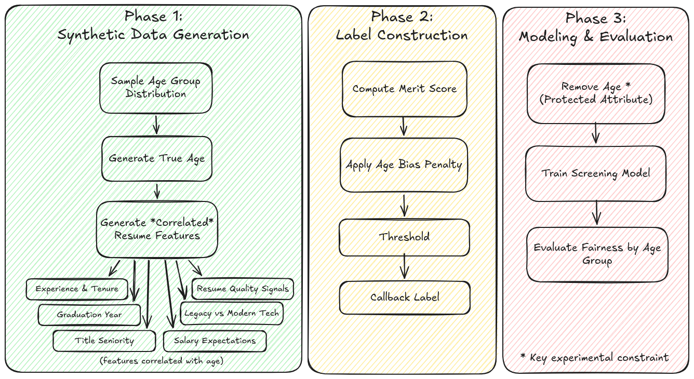
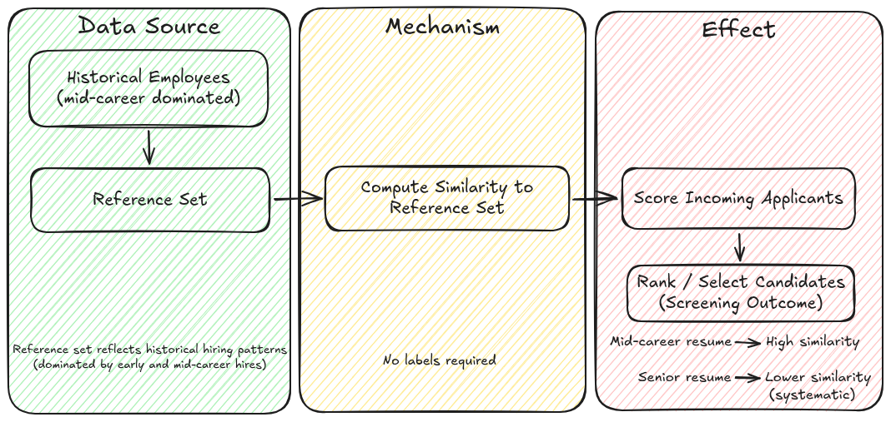
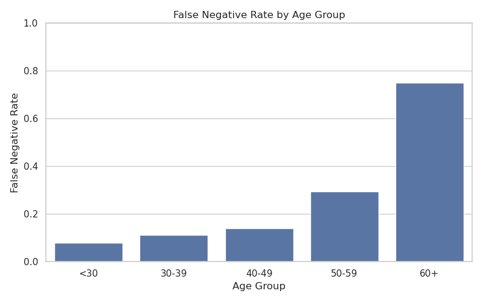
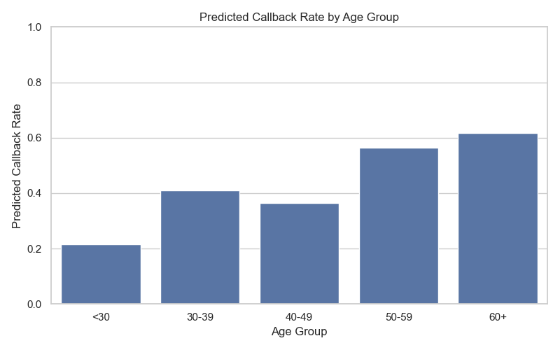
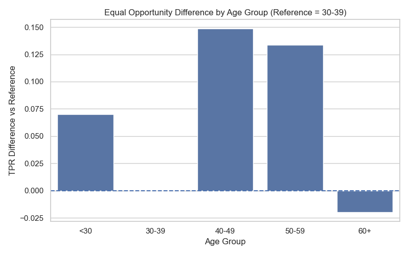

# Resume Screening Proxy Bias Experiment

## Executive Summary

This project investigates whether machine learning systems used in resume screening can produce age-related disparities **without explicitly using age as an input feature**, and whether removing obvious proxy variables (such as graduation year) is sufficient to mitigate those effects.



*Figure 1. Synthetic data generation, label construction, and downstream evaluation pipeline.*

Two complementary experiments were conducted:

### 1. Supervised Screening Model (Experiment A)
A classification model was trained to predict callback outcomes based on resume features, with age excluded from training inputs.

- The model reproduced age-related disparities using proxy features.
- Older candidates experienced significantly higher false negative rates.
- Removing `graduation_year` had minimal impact on both performance and fairness outcomes.

### 2. Similarity-Based Screening (Experiment B)

## Experiment B — Similarity-Based Screening



*Figure 2: Similarity-based screening can disadvantage senior candidates when the reference population is dominated by mid-career profiles.*

Applicants were scored based on similarity to a reference set of historically successful employees.

- No training labels were used.
- In 100% of matched-pair comparisons, more senior candidates received lower similarity scores.
- This effect persisted even after removing `graduation_year`.

### Key Findings

- Age can be predicted from resume features with:
  - **93.5% accuracy with graduation year**
  - **72.9% accuracy without graduation year**
- Removing a single proxy feature does not eliminate bias.
- Disparities emerge from the **combined structure of correlated features**, not any single variable.
- Bias can arise from both:
  - training data (supervised models)
  - reference population structure (similarity-based systems)
  
## Visual Overview


*Figure 1. Synthetic data generation, label construction, and downstream evaluation pipeline.*


*Figure 2: Similarity-based screening can disadvantage senior candidates when the reference population is dominated by mid-career profiles.*

## Key Results



*Figure 3. False negative rates increase sharply for older groups, indicating that qualified older candidates are more likely to be incorrectly rejected.*



*Figure 4. The screening model reproduces substantial age-related disparities in predicted callback rates despite excluding age from training features.*



*Figure 5. Equal opportunity declines for older groups relative to the reference group, showing unequal true positive rates across ages.*

### Conclusion

Machine learning-based resume screening systems can produce and sustain age-related disparities even when age is excluded from inputs. Effective mitigation requires addressing the broader structure of feature relationships rather than removing individual variables.

---

## Overview

This project investigates whether machine learning models used in resume screening can learn and reproduce age-related disparities **without being explicitly provided age information**, through the use of correlated proxy variables such as:

- Years of experience  
- Graduation year  
- Title seniority  
- Salary expectations  
- Legacy vs. modern technology signals  

The core objective is to demonstrate how proxy feature leakage can produce measurable disparities in model outcomes even when protected attributes are excluded from training.

---

## Research Question

Can a resume-screening model produce systematically different outcomes for older candidates due to proxy features, even when age is not included in the feature set?

---

## Experimental Design

1. **Synthetic Resume Generation**
   - Realistic correlations between latent age group and resume features  
   - Adjustable bias strength in simulated hiring outcome  
   - Fully reproducible via fixed seed and metadata  

2. **Model Training**
   - Logistic Regression (baseline)  
   - Age and `age_group` excluded from feature set  

3. **Fairness Evaluation**
   - Callback rate by age group  
   - False Positive / False Negative rates  
   - Statistical Parity Difference  
   - Disparate Impact Ratio  
   - Equal Opportunity Difference  

4. **Ablation Study**
   - Compare models trained:
     - With `graduation_year`
     - Without `graduation_year`  
   - Measure persistence of disparity  

5. **Age Predictability Analysis**
   - Train models to predict `age_group` from resume features  
   - Evaluate recoverability of protected attributes  

6. **Similarity-Based Screening**
   - Score applicants based on similarity to a reference population  
   - Analyze disparities without supervised labels  
   - Conduct matched-pair comparisons  

---

## Repository Structure

resume-screening-proxy-bias/
│
├── data/
│ ├── baseline/
│ └── experiments/
│
├── notebooks/
│ ├── resume_screening_proxy_bias_experiment.ipynb
│ ├── 01_data_generation.ipynb
│ ├── 02_model_training.ipynb
│ ├── 03_fairness_evaluation.ipynb
│ ├── 04_ablation_graduation_year.ipynb
│ ├── 05_age_group_predictability.ipynb
│ └── 06_similarity_screening_experiment.ipynb
│
├── models/
├── reports/
│ ├── diagrams/
│ ├── figures/
│ └── tables/
│
└── src/


---

## Reproducibility

The synthetic dataset is generated using:

- Fixed random seed  
- Explicit bias strength parameter  
- Stored generation metadata (`generation_metadata.json`)  

This allows exact replication of experiments.

---

## Key Insight Being Tested

Even when age is removed from training data, machine learning systems may still:

- Infer age from correlated features  
- Encode that signal in model behavior  
- Produce unequal outcomes across age groups  

This project isolates and measures that effect.

---

## Requirements

Install dependencies:

```bash
pip install -r requirements.txt

Primary libraries:
* pandas
* numpy
* scikit-learn
* matplotlib
* seaborn
* pyarrow


## Status

Completed:
* Synthetic data generator
* Baseline model training
* Fairness evaluation
* Graduation year ablation study
* Age predictability analysis
* Similarity-based screening experiment

## Notes

This project uses synthetic data to provide a controlled environment for analyzing bias mechanisms. Results should be interpreted as demonstrations of model behavior under structured conditions rather than direct claims about any specific real-world system.
