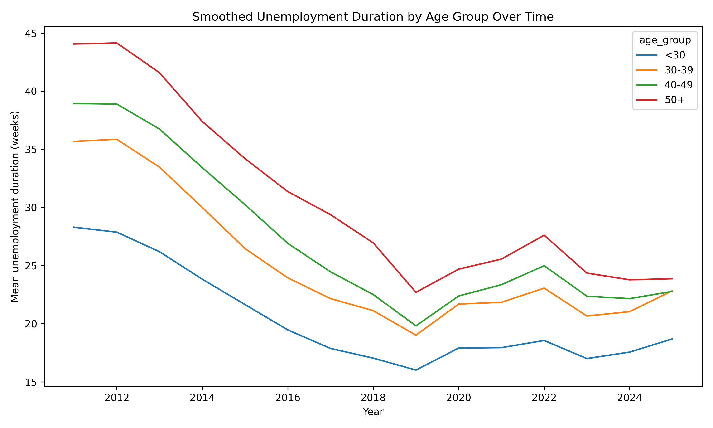

# Resume Screening Proxy Bias Experiment

## Executive Summary

This project investigates whether machine learning systems used in resume screening can produce age-related disparities **without explicitly using age as an input feature**, and whether removing obvious proxy variables (such as graduation year) is sufficient to mitigate those effects.

Two complementary experiments were conducted:

### 1. Supervised Screening Model (Experiment A)

*Figure 1. Synthetic data generation, label construction, and downstream evaluation pipeline.*

A classification model was trained to predict callback outcomes based on resume features, with age excluded from training inputs.

- The model reproduced age-related disparities using proxy features  
- Older candidates experienced significantly higher false negative rates  
- Removing `graduation_year` had minimal impact on both performance and fairness outcomes  

---

### 2. Similarity-Based Screening (Experiment B)

*Figure 2. Similarity-based screening can disadvantage senior candidates when the reference population is dominated by mid-career profiles.*

Applicants were scored based on similarity to a reference set of historically successful employees.

- No training labels were used  
- In 100% of matched-pair comparisons, more senior candidates received lower similarity scores  
- This effect persisted even after removing `graduation_year`  

---

### Key Findings

- Age can be inferred from resume features with:
  - **93.5% accuracy with graduation year**
  - **72.9% accuracy without graduation year**
- Removing a single proxy feature does not eliminate bias  
- Disparities emerge from the **combined structure of correlated features**, not any single variable  
- Bias can arise from both:
  - training data (supervised models)
  - reference population structure (similarity-based systems)

These experimental findings are further supported by real-world labor market data, which shows that older workers experience greater difficulty re-entering the workforce.

---

# Real-World Labor Market Evidence

To ground the experimental results, we analyzed U.S. labor market data using the Current Population Survey (CPS) via IPUMS.

## Methodology

- Data Source: IPUMS CPS Basic Monthly (2010–2024)  
- Population: Individuals aged 18+  
- Weighting: All statistics use CPS person weights (`WTFINL`)  
- Unemployment defined as `EMPSTAT ∈ {20, 21, 22}`  
- Unemployment duration measured using `DURUNEMP` (weeks)  
- Time trends smoothed using a 3-year rolling average  

## Results

*Figure 3. Smoothed unemployment duration by age group. Older workers consistently experience longer job search durations across time.*

### Key Observations

- **Unemployment duration increases monotonically with age**  
- Workers aged 50+ remain unemployed approximately **40–60% longer** than workers under 30  
- The pattern persists across economic cycles  
- The relationship is structural, not cyclical  

## Interpretation

> Older workers have consistently faced greater difficulty re-entering the workforce once unemployed.

---

# Connecting Empirical Evidence and Model Behavior

The experiments demonstrate how modern screening systems can reproduce similar patterns:

- Proxy features encode age signals  
- Similarity-based systems favor mid-career profiles  
- Effects persist without explicit age inputs  

---

# Updated Hypothesis

> Older workers have long faced structural challenges in re-employment. Machine learning-based resume screening systems can reproduce and potentially amplify these patterns, even without explicit age input.

---

## Key Results (Experimental)

---

## Conclusion

Machine learning-based resume screening systems can reproduce—and potentially amplify—age-related disparities already present in real-world labor market outcomes.

---

## Notes

This project uses synthetic data for controlled analysis of bias mechanisms.

---

## Data Access

The CPS dataset used in this project is not included in the repository due to size constraints.

To reproduce the analysis:
1. Create an account at IPUMS CPS (https://cps.ipums.org/)
2. Extract Basic Monthly CPS data for 2010–2024
3. Select variables:
   - AGE, EMPSTAT, DURUNEMP, OCC2010, WTFINL, YEAR, MONTH
4. Save the file to:
   data/raw/ipums_cps/

Then run:
notebooks/00_cps_data_prep.ipynb
