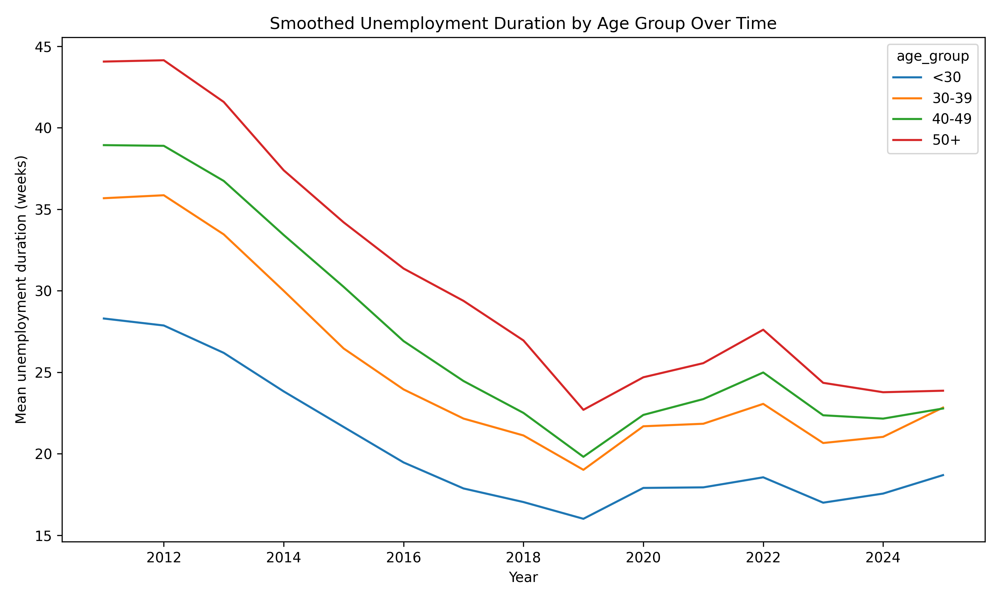
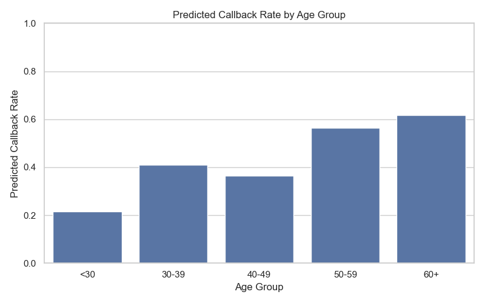
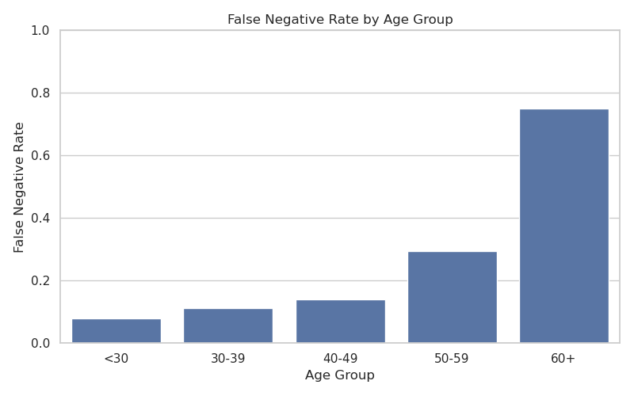
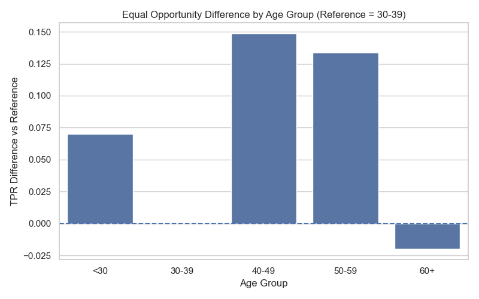
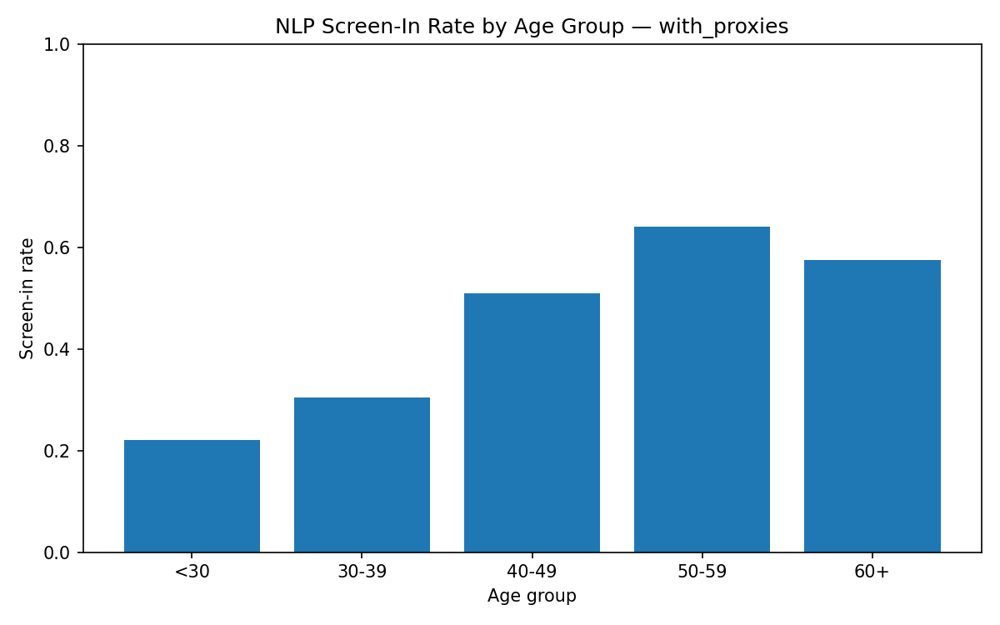
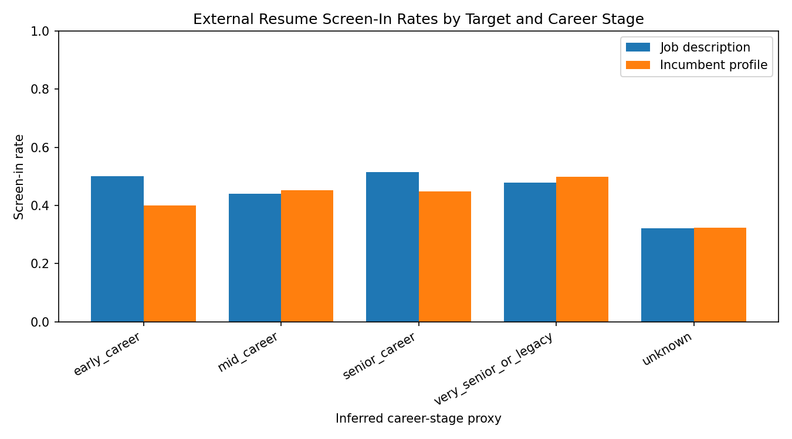

# Resume Screening Proxy Bias Experiment

## Executive Summary

This project investigates whether resume-screening systems can produce age-related disparities **without explicitly using age as an input feature**, and whether removing obvious proxy variables such as `graduation_year` is enough to mitigate those effects.

The project combines controlled synthetic experiments, U.S. labor-market context, full-text resume screening, incumbent-profile similarity screening, and a supplementary real-resume validation exercise.

The central finding is straightforward:

> Age-related disparities can persist even when age is excluded from the model and even when direct age proxies are removed. The risk comes from the combined structure of correlated resume features, historical reference populations, and screening targets.

---

## Research Question

Can machine learning and NLP-based resume-screening systems reproduce or amplify age-related disparities without using explicit age inputs?

More specifically:

- Can structured resume features predict callback outcomes in ways that disadvantage older candidates?
- Does removing `graduation_year` materially reduce the disparity?
- Can age group still be inferred from other resume features?
- Do similarity-based screens favor candidates who resemble a mid-career incumbent/reference population?
- Do full-text resume embeddings show different behavior depending on whether candidates are scored against a job description or against incumbent profiles?
- Can the same screening framework be applied to real external resume text?

---

## Project Structure

| Notebook | Purpose |
|---|---|
| `00_cps_data_prep.ipynb` | Establishes real-world labor-market context using CPS unemployment-duration data. |
| `01_data_generation.ipynb` | Generates controlled synthetic resume data with known age groups and callback labels. |
| `02_model_training.ipynb` | Trains the baseline supervised resume-screening model. |
| `03_fairness_evaluation.ipynb` | Evaluates callback rates, false negative rates, selection rates, and fairness metrics by age group. |
| `04_ablation_graduation_year.ipynb` | Tests whether removing `graduation_year` changes model performance or fairness outcomes. |
| `05_age_group_predictability.ipynb` | Tests whether age group can be inferred from resume features even when age is excluded. |
| `06_similarity_screening_experiment.ipynb` | Simulates structured similarity-based screening against a mid-career reference population. |
| `07_nlp_fulltext_resume_experiment.ipynb` | Converts structured resumes into full-text resumes and scores them against job-description embeddings. |
| `08_fulltext_incumbent_similarity_experiment.ipynb` | Compares full-text job-description screening against full-text incumbent-profile similarity screening. |
| `09_external_resume_career_stage_validation.ipynb` | Applies the full-text framework to real Kaggle resumes using inferred career-stage proxies. |

---

## Real-World Labor Market Context

To ground the project, U.S. labor-market data was analyzed using the Current Population Survey (CPS) via IPUMS.

### Methodology

- Data source: IPUMS CPS Basic Monthly
- Population: Individuals aged 18+
- Weighting: CPS person weights (`WTFINL`)
- Unemployment definition: `EMPSTAT ∈ {20, 21, 22}`
- Unemployment duration: `DURUNEMP` in weeks
- Trends: 3-year rolling average

### Key CPS Results

Across the CPS sample, mean unemployment duration increased with age:

| Age group | Mean unemployment duration |
|---|---:|
| `<30` | 21.9 weeks |
| `30-39` | 27.2 weeks |
| `40-49` | 30.0 weeks |
| `50+` | 32.9 weeks |



*Figure 1. Smoothed unemployment duration by age group. Older workers experience longer unemployment durations across most years.*

### Interpretation

The CPS analysis does not prove that resume-screening models cause older-worker disadvantage. It establishes that older workers already face longer re-employment durations in the broader labor market. The modeling experiments then test whether screening systems can reproduce similar patterns through proxy features and reference-population effects.

---

## Experiment A: Structured Supervised Screening Model


*Figure 2. Synthetic data generation, label construction, and downstream evaluation pipeline.*

A supervised classification model was trained to predict callback outcomes from structured resume features. Age was excluded from model inputs.

### Baseline Model Performance

| Metric | Value |
|---|---:|
| Accuracy | 0.872 |
| Precision | 0.870 |
| Recall | 0.875 |
| F1 | 0.872 |
| ROC AUC | 0.948 |

The model performed well overall, but its outcomes varied sharply by age group.

### Callback and Error Rates by Age Group

| Age group | Actual callback rate | Predicted callback rate | False negative rate |
|---|---:|---:|---:|
| `<30` | 55.7% | 59.7% | 7.8% |
| `30-39` | 70.7% | 69.7% | 11.3% |
| `40-49` | 47.3% | 47.3% | 13.9% |
| `50-59` | 15.1% | 15.5% | 29.5% |
| `60+` | 12.0% | 3.0% | 75.0% |







### Interpretation

Even without explicit age input, the model reproduced strong age-related differences. The oldest group had the lowest predicted callback rate and the highest false negative rate.

---

## Experiment B: Graduation-Year Ablation

The project then tested whether removing `graduation_year` reduced either model performance or disparity.

| Model variant | Accuracy | F1 | ROC AUC |
|---|---:|---:|---:|
| With `graduation_year` | 0.872 | 0.872 | 0.948 |
| Without `graduation_year` | 0.870 | 0.870 | 0.948 |

Predicted callback rates barely changed:

| Age group | With `graduation_year` | Without `graduation_year` | Difference |
|---|---:|---:|---:|
| `<30` | 59.7% | 58.5% | -1.2 pp |
| `30-39` | 69.7% | 69.2% | -0.5 pp |
| `40-49` | 47.3% | 47.1% | -0.2 pp |
| `50-59` | 15.5% | 16.2% | +0.7 pp |
| `60+` | 3.0% | 3.0% | 0.0 pp |

### Interpretation

Removing `graduation_year` did not meaningfully change model performance or fairness outcomes. The disparity was not caused by one obvious proxy. It was encoded across many correlated features.

---

## Experiment C: Age-Group Predictability

To test whether age information remained present in the feature set, models were trained to predict age group from resume features.

| Feature set | Age-group prediction accuracy | Macro F1 |
|---|---:|---:|
| With `graduation_year` | 93.5% | 93.2% |
| Without `graduation_year` | 72.9% | 72.5% |

### Interpretation

Age group remained highly predictable even after removing `graduation_year`. Resume structure itself contains age-correlated information: years of experience, title level, management history, technology mix, career continuity, salary expectations, and similar signals.

---

## Experiment D: Structured Similarity-Based Screening


*Figure 3. Similarity-based screening can disadvantage senior candidates when the reference population is dominated by mid-career profiles.*

Applicants were scored by similarity to a reference population of historically successful employees. This experiment used no training labels.

### Broad Applicant-Pool Results

| Age group | Similarity score, with `graduation_year` | Pass rate, with `graduation_year` | Similarity score, without `graduation_year` | Pass rate, without `graduation_year` |
|---|---:|---:|---:|---:|
| `<30` | 0.397 | 50.1% | 0.400 | 50.5% |
| `30-39` | 0.415 | 60.6% | 0.415 | 59.0% |
| `40-49` | 0.364 | 35.5% | 0.368 | 36.2% |
| `50-59` | 0.255 | 4.1% | 0.265 | 5.4% |
| `60+` | 0.184 | 0.0% | 0.197 | 0.0% |

### Matched-Pair Results

In matched-pair comparisons, the more senior version of the same candidate received lower similarity scores in **100%** of comparisons.

| Model variant | Mean senior-minus-midcareer similarity delta | Percent senior lower |
|---|---:|---:|
| With `graduation_year` | -0.190 | 100% |
| Without `graduation_year` | -0.191 | 100% |

### Interpretation

Similarity-based systems can create disparities even without supervised labels. If the reference population is concentrated around mid-career profiles, candidates with longer or less typical career histories can be penalized for being less similar to the historical reference set.

---

## Experiment E: Full-Text Resume Screening Against Job Descriptions

The project then moved from structured features to generated full-text resumes. Synthetic structured resumes were converted into realistic resume text under factual-preservation constraints.

Three text-generation modes were evaluated:

- `minimal_proxy`
- `with_proxies`
- `without_direct_age_proxies`

The resumes passed basic generation-quality checks: no empty resumes, no placeholder leakage, no explicit protected-field terms, and no direct age phrases detected in the audit.

### Job-Description Similarity Results

When full-text resumes were scored against job-description embeddings, older candidates often scored **higher**, not lower.

| Generation mode | `<30` screen rate | `30-39` screen rate | `40-49` screen rate | `50-59` screen rate | `60+` screen rate |
|---|---:|---:|---:|---:|---:|
| `minimal_proxy` | 29.0% | 26.5% | 42.0% | 63.0% | 64.5% |
| `with_proxies` | 22.0% | 30.5% | 51.0% | 64.0% | 57.5% |
| `without_direct_age_proxies` | 20.5% | 30.0% | 49.0% | 63.0% | 62.5% |



### Interpretation

This result is important because it does **not** simply reproduce the structured supervised model. Generic job-description similarity rewarded experience-heavy resumes. That means the screening target matters: scoring against a job description is not the same as scoring against historical incumbent profiles.

---

## Experiment F: Full-Text Incumbent-Profile Similarity

Notebook 08 compared two full-text screening targets:

1. similarity to the job description;
2. similarity to a synthetic incumbent/reference employee population.

This created a more realistic contrast between a requirements-based screen and an incumbent-profile screen.

### Job Description vs. Incumbent Profile

| Mode | Age group | Job-description screen rate | Incumbent-profile screen rate |
|---|---|---:|---:|
| `minimal_proxy` | `<30` | 29.0% | 34.5% |
| `minimal_proxy` | `30-39` | 26.5% | 59.0% |
| `minimal_proxy` | `40-49` | 42.0% | 54.5% |
| `minimal_proxy` | `50-59` | 63.0% | 42.0% |
| `minimal_proxy` | `60+` | 64.5% | 35.0% |
| `with_proxies` | `<30` | 22.0% | 23.0% |
| `with_proxies` | `30-39` | 30.5% | 51.0% |
| `with_proxies` | `40-49` | 51.0% | 58.0% |
| `with_proxies` | `50-59` | 64.0% | 53.5% |
| `with_proxies` | `60+` | 57.5% | 39.5% |
| `without_direct_age_proxies` | `<30` | 20.5% | 27.0% |
| `without_direct_age_proxies` | `30-39` | 30.0% | 49.5% |
| `without_direct_age_proxies` | `40-49` | 49.0% | 59.5% |
| `without_direct_age_proxies` | `50-59` | 63.0% | 50.5% |
| `without_direct_age_proxies` | `60+` | 62.5% | 38.5% |

### Interpretation

The target definition strongly affects fairness behavior. Job-description similarity tends to reward accumulated experience, while incumbent-profile similarity can favor candidates who resemble the reference population. This distinction is central to the project:

> A model can look neutral or even favorable under one screening target while producing disadvantage under another.

---

## Experiment G: External Resume Career-Stage Validation

Notebook 09 applies the full-text framework to a real Kaggle resume dataset.

Because the external dataset does **not** include true age labels, it uses inferred career-stage proxies rather than protected attributes. The results should therefore be interpreted as supplementary evidence, not as a definitive age-bias measurement.

### External Dataset Summary

| Career-stage proxy | Rows |
|---|---:|
| `mid_career` | 5,204 |
| `very_senior_or_legacy` | 1,642 |
| `senior_career` | 1,392 |
| `unknown` | 632 |
| `early_career` | 130 |

The dataset contains 9,000 technical resume rows, and about 71.3% include stated years of experience.

### External Screening Results

| Career-stage proxy | Job-description screen rate | Incumbent-profile screen rate |
|---|---:|---:|
| `early_career` | 50.0% | 40.0% |
| `mid_career` | 44.0% | 45.2% |
| `senior_career` | 51.5% | 44.8% |
| `very_senior_or_legacy` | 47.7% | 49.8% |
| `unknown` | 32.1% | 32.3% |



### Interpretation

The external real-resume results are mixed. The `very_senior_or_legacy` group performs relatively well against the incumbent-profile target, which differs from the controlled synthetic mechanism. That likely reflects the external dataset's concentration in enterprise software resumes with terminology that overlaps strongly with the synthetic reference population.

The strongest conclusion from Notebook 09 is therefore limited but useful:

> The full-text screening framework can be applied to real resume text, but the external dataset validates pipeline portability more than it validates the age-bias mechanism directly.

---

## Consolidated Findings

1. **Explicit age is not required for age-related disparities to appear.**  
   The supervised model produced sharply different callback and false-negative rates by age group without using age as an input.

2. **Removing `graduation_year` is not enough.**  
   The ablation barely changed accuracy, ROC AUC, predicted callback rates, or equal opportunity differences.

3. **Age remains inferable from resume structure.**  
   Age-group prediction accuracy remained 72.9% even without `graduation_year`.

4. **Similarity-based screening can disadvantage non-reference-like candidates.**  
   In structured matched-pair tests, senior candidates received lower similarity scores in 100% of comparisons.

5. **The screening target matters.**  
   Job-description similarity and incumbent-profile similarity can produce materially different outcomes.

6. **Full-text NLP results are not automatically equivalent to structured-feature results.**  
   Job-description similarity often rewarded seniority, while incumbent-profile similarity favored candidates closer to the reference population.

7. **External real-resume validation is useful but limited.**  
   The Kaggle dataset supports pipeline portability, but it lacks true age labels and is imbalanced by inferred career stage.

---

## Updated Hypothesis

> Older workers have long faced structural challenges in re-employment. Machine learning and NLP-based resume-screening systems can reproduce, reshape, or amplify those patterns when resume features, labels, reference populations, or screening targets encode age-correlated information.

---

## Conclusion

This project does not claim that every resume-screening model will disadvantage older candidates. The stronger and more defensible conclusion is that resume-screening systems can produce age-related disparities through multiple mechanisms:

- supervised learning from biased labels;
- proxy leakage across correlated resume features;
- reference-population similarity effects;
- incumbent-profile screening targets;
- full-text embedding behavior that depends heavily on the target being used.

The practical implication is that removing direct protected attributes or one obvious proxy feature is not a sufficient fairness control. Resume-screening systems need to be audited across age groups, proxy features, reference-set construction, target definitions, and screening thresholds.

---

## Notes and Limitations

- Synthetic data is used for controlled mechanism testing.
- CPS data provides labor-market context, not causal evidence about resume-screening systems.
- The external Kaggle dataset lacks true age labels.
- Career-stage proxies in Notebook 09 should not be interpreted as protected age labels.
- Similarity scores depend on embedding model choice, prompt design, reference-set composition, and thresholding strategy.
- The project focuses on age-related proxy bias and does not fully evaluate intersectional effects.

---

## Reproducing the Analysis

### CPS Data

The CPS dataset is not included in this repository due to size constraints.

To reproduce the CPS analysis:

1. Create an account at IPUMS CPS.
2. Extract Basic Monthly CPS data.
3. Select variables:
   - `AGE`
   - `EMPSTAT`
   - `DURUNEMP`
   - `OCC2010`
   - `WTFINL`
   - `YEAR`
   - `MONTH`
4. Save the file to:

```text
data/raw/ipums_cps/
```

5. Run:

```text
notebooks/00_cps_data_prep.ipynb
```

### Kaggle Resume Dataset

Notebook 09 uses the Kaggle Resume Dataset as an external validation source.

Save the CSV as:

```text
data/external/resume_dataset.csv
```

Then run:

```text
notebooks/09_external_resume_career_stage_validation.ipynb
```

---

## Repository Outputs

Key outputs are written under:

```text
data/experiments/
reports/tables/
reports/figures/
reports/figures/cps/
```

Important figures include:

```text
reports/figures/cps/unemployment_duration_age_group_smoothed.png
reports/figures/predicted_callback_rate_by_age_group.png
reports/figures/false_negative_rate_by_age_group.png
reports/figures/equal_opportunity_difference_by_age_group.png
reports/figures/nlp_screen_rate_by_age_with_proxies.png
reports/figures/external_jobdesc_vs_incumbent_screen_rates_by_career_stage.png
```
