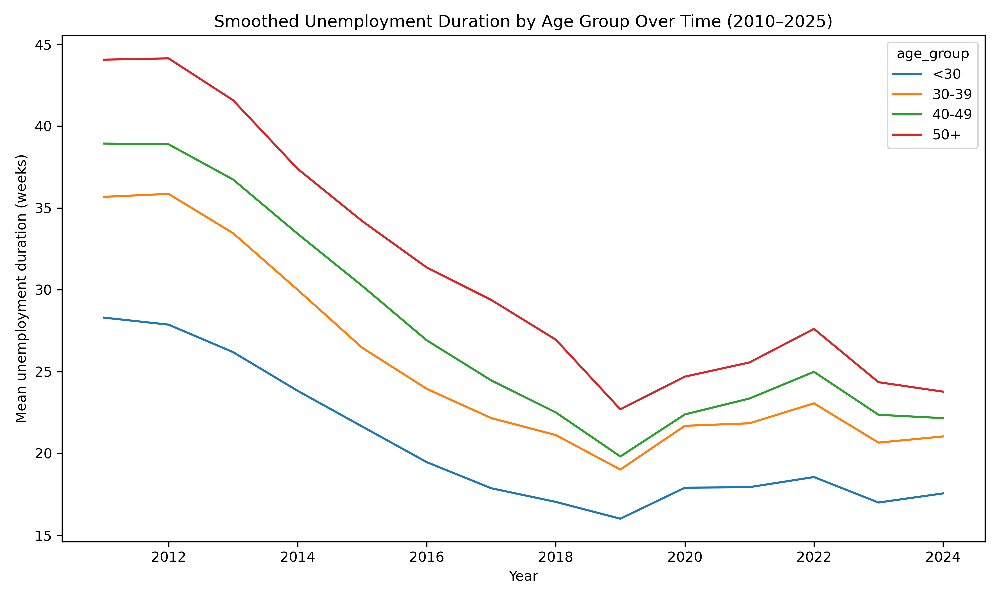
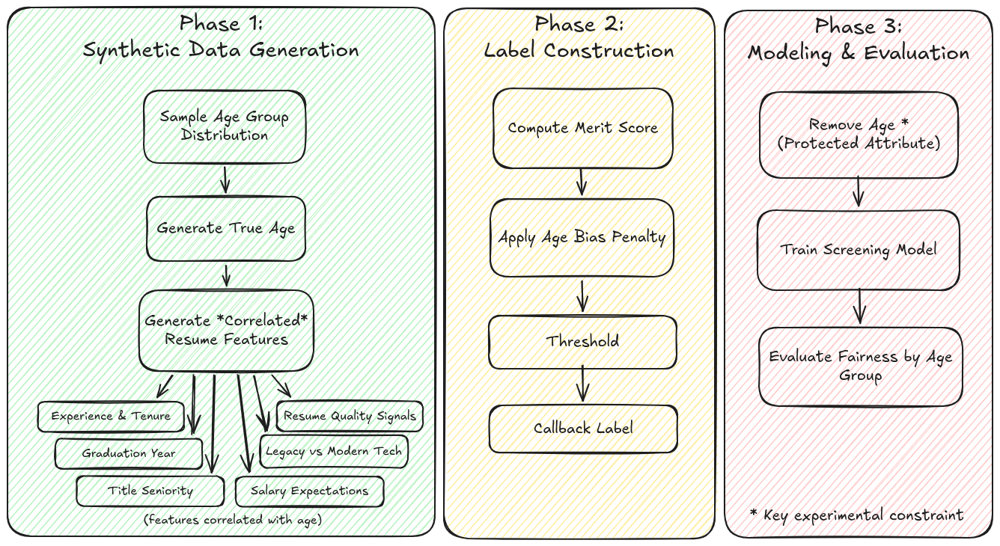
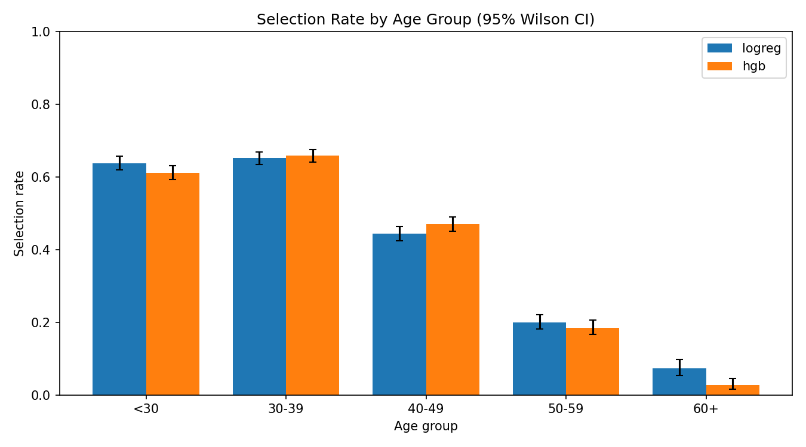
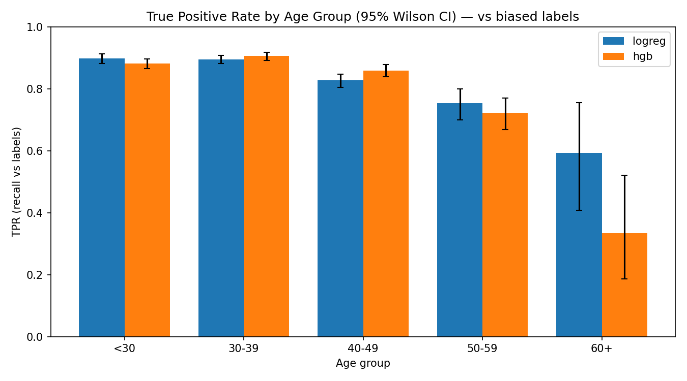
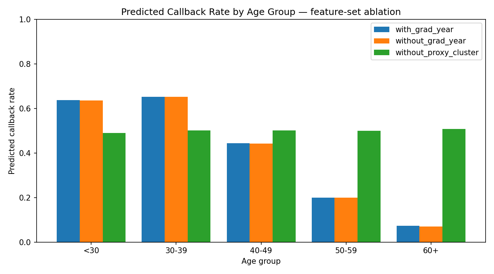
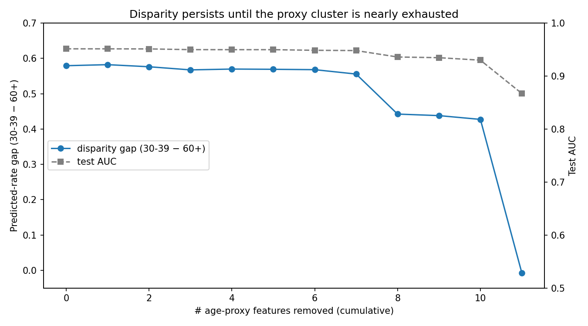
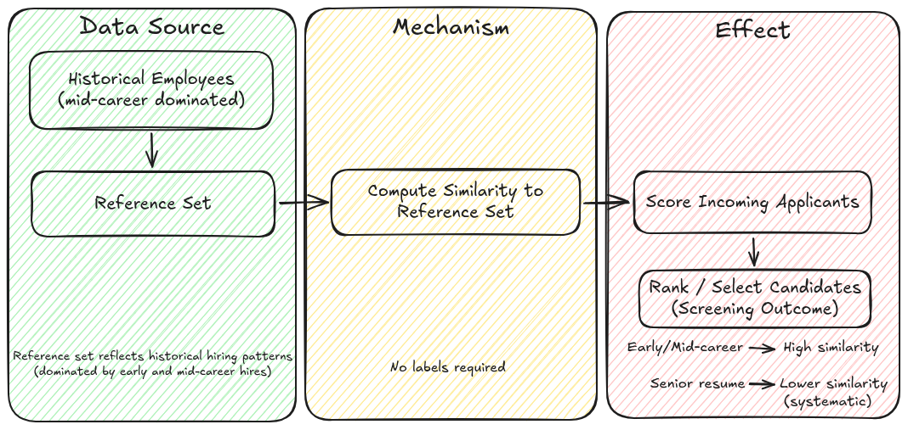
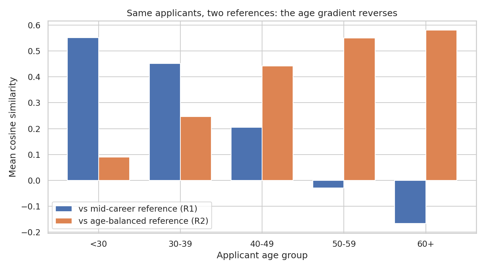
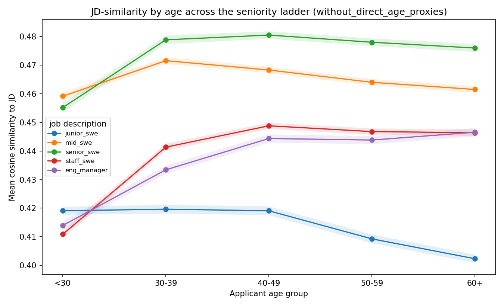
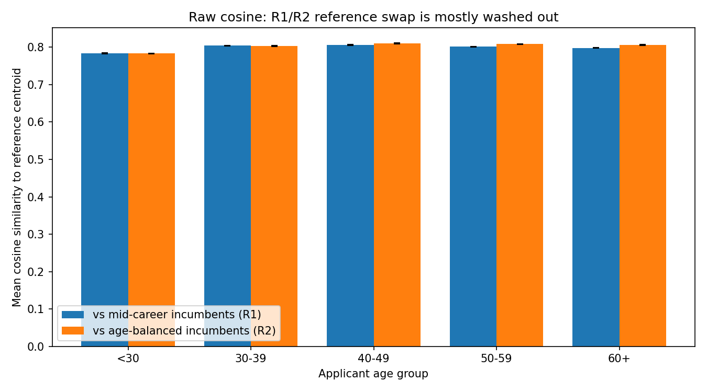

# Résumé Screening Proxy Bias Experiment

## Executive Summary

This project asks whether résumé-screening systems can produce **age-related disparities without using age as an input** — and, when they do, what actually drives the direction and size of the gap.

The work combines a controlled synthetic testbed, U.S. labor-market context from CPS, structured supervised screening, structured similarity screening, full-text résumé screening against job descriptions and incumbent profiles, and a supplementary real-résumé validation.

The central finding is specific rather than universal:

> Facially neutral screening can **transmit** age-related disparities without using age directly. Ordinary résumé features — experience, tenure, title, technology mix, salary expectation, and related signals — act as redundant age proxies. Removing one obvious proxy, such as `graduation_year`, does little. The **direction** of a screening disparity depends heavily on the screening target: scoring the same résumés against a mid-career incumbent/reference pool penalizes older candidates, while scoring them against a senior job description can favor them.

The strongest mechanisms are established in the controlled synthetic setting. The real-résumé validation supports the job-description seniority mechanism, but the incumbent-reference mechanism does **not** cleanly transfer to the external corpus and is reported as inconclusive.

### Headline: where the structured score gap comes from

Decomposing the structured callback-score gap between the strongest mid-career band (`30-39`) and the oldest band (`60+`) — a systematic score gap of about **0.142** — attributes the gap primarily to feature structure rather than to an explicit age term:

| Source | Share of the `30-39` vs `60+` score gap |
|---|---:|
| **Structural**: job-relevant features that correlate with age | **82%** |
| **Explicit** age term in the label generator | **19%** |
| **Base merit**: age-independent quality | **−1%** |

The explicit age knob contributes a minority of the gap. The dominant channel is the correlated feature structure that survives the “remove the obvious proxy” fixes tested below. Shares are rounded and need not sum to exactly 100%.

---

## Research Question

Can supervised and embedding-based résumé-screening systems reproduce age-related disparities without using explicit age inputs — and what determines the direction and magnitude of those disparities?

More specifically:

- Do structured résumé features predict callbacks in ways that disadvantage older candidates, and does the model amplify the disparity present in the labels, or mainly transmit it?
- Does removing `graduation_year` — or any single proxy — materially reduce the disparity?
- Can age group still be inferred once age and obvious age markers are removed, and does mere predictability imply a disparity?
- Do similarity-based screens favor candidates who resemble the reference population?
- Does full-text embedding behavior depend on whether candidates are scored against a job description or against incumbent profiles?
- Do the synthetic mechanisms appear on real résumé text?

---

## Project Structure

| Notebook | Purpose |
|---|---|
| `00_cps_data_prep.ipynb` | Real-world labor-market context from CPS unemployment-duration data. |
| `01_data_generation.ipynb` | Generates the controlled synthetic résumé dataset: 50,000 rows with known age groups, callback labels, and a built-in negative control; decomposes the score gap. |
| `02_model_training.ipynb` | Trains the baseline supervised screening models: logistic regression and histogram gradient boosting. |
| `03_fairness_evaluation.ipynb` | Evaluates selection rates, disparate impact, true-positive rates, false-negative rates, and equal-opportunity differences by age; includes the negative-control check. |
| `04_ablation_graduation_year.ipynb` | Tests removing `graduation_year`, then the full proxy cluster; includes incremental ablation and confidence intervals. |
| `05_age_group_predictability.ipynb` | Tests how recoverable age group is from résumé features with age excluded; separates recoverability from disparity. |
| `06_similarity_screening_experiment.ipynb` | Runs structured similarity screening and a reference-composition swap. |
| `07_nlp_fulltext_resume_experiment.ipynb` | Scores full-text synthetic résumés against a job-description seniority ladder. |
| `08_fulltext_incumbent_similarity_experiment.ipynb` | Scores full-text synthetic résumés against incumbent/reference profiles; examines raw cosine and mean-centered cosine. |
| `09_external_resume_career_stage_validation.ipynb` | Applies the framework to real Kaggle résumé text using inferred career-stage proxies. |

The structured modeling notebooks use a canonical feature list from `src/features.py` with **51 trained features** after excluding protected attributes, labels, and label-internal scoring columns. The feature schema is validated where structured features are consumed for modeling or scoring. Proportion comparisons use Wilson confidence intervals where intervals are reported.

Supervised model, fairness, ablation, and age-predictability results use the common **40,000 / 10,000 train/test split**. The structured-similarity, full-text, and external-validation notebooks use separate applicant/reference pools described in their sections.

### Shared code (`src/`)

The notebooks rely on a small set of shared modules so core definitions are centralized rather than duplicated.

| Module | Provides |
|---|---|
| `src/paths.py` | Project-root–anchored directory constants (`BASELINE_DIR`, `EXPERIMENTS_DIR`, `EMBEDDINGS_DIR`, `TABLES_DIR`, …) and `rel()` for repo-relative path printing. |
| `src/features.py` | The canonical 51-feature list, the proxy cluster, `AGE_ORDER`, and schema validators (`validate_features`). |
| `src/metrics.py` | `wilson_ci` and `mean_ci`. |
| `src/preprocessing.py` | `split_feature_types` / `make_preprocessor` — the sklearn preprocessing shared by all structured models. |
| `src/models.py` | `make_baseline_models` (logistic regression + histogram gradient boosting with fixed seeds). |
| `src/data_generation.py` | The synthetic generator, `load_or_generate` caching, and `dataset_fingerprint` provenance hashing. |
| `src/fulltext.py` | Full-text corpus loading with fingerprint verification, the faithfulness and text-leakage gates, and the constants notebooks 07–08 must agree on (`MODES`, `FOCAL_MODE`, `TRUE_PROPORTIONS`, `SCREEN_RATE`). |
| `src/embedding.py` | The shared `Embedder` (OpenAI / `bge-m3`) with on-disk caching keyed by backend, model, and content hash, plus an explicit API-spend guard. |
| `src/data_processing/cps_processing.py` | CPS extract standardization and the unemployment summaries used in notebook 00. |
| `src/llm_resume_generation.py` | Renders the structured résumés into the three full-text corpora — the expensive LLM layer; run deliberately, not as part of routine re-execution. |

---

## Real-World Labor Market Context

To ground the project, U.S. labor-market data was analyzed using the Current Population Survey (CPS) via IPUMS.

### Methodology

- Data source: IPUMS CPS Basic Monthly
- Source window: January 2010 through April 2026
- Population: individuals aged 18+; career-stage summaries use 22+
- Weighting: CPS person weights (`WTFINL`); records with `WTFINL ≤ 0` are dropped, which excludes ASEC supplement rows from the monthly series
- Unemployment definition: `EMPSTAT ∈ {21, 22}` (looking for work / on layoff; code 20 does not occur in the Basic Monthly extract)
- Rate denominator: the labor force (`EMPSTAT ∈ {10, 12, 20, 21, 22}`), not the full population
- Unemployment duration: `DURUNEMP` in weeks
- Trend years: full calendar years 2010–2025
- 2026 treatment: January–April 2026 is partial-year context only, not a comparable annual trend point
- Trend smoothing: 3-year rolling average

### Key CPS Results

Mean unemployment **duration** rises monotonically with age, even though the unemployment *rate* falls with age:

| Age group | Mean unemployment duration |
|---|---:|
| `<30` | 21.9 weeks |
| `30-39` | 27.2 weeks |
| `40-49` | 30.0 weeks |
| `50+` | 32.9 weeks |



*Figure 1. Smoothed unemployment duration by age group. Older workers face longer re-employment durations across most years.*

A note on binning: the CPS summaries use four age bands (`<30`, `30-39`, `40-49`, `50+`; career-stage bins 22–32, 33–42, 43–52, 53+), while the synthetic experiments use five bands that split `50-59` from `60+`. The CPS `50+` band is therefore not directly comparable to the synthetic `60+` band.

This CPS analysis is **not** tech-sector-specific. Occupation is not reliably defined for unemployed individuals in CPS, so the CPS section provides broad labor-market context rather than causal evidence about technical hiring or résumé-screening systems. The experiments below test whether screening mechanisms can reproduce age-related disparities through proxy features and reference-population effects.

---

## The Synthetic Testbed



*Figure 2. Synthetic data generation, label construction, and downstream evaluation pipeline.*

The structured dataset contains **50,000 synthetic résumés** with known age, a canonical 51-feature training schema, and callback labels generated under a transparent scoring function. Age and age group are never used as screening-model inputs.

Two design features make the mechanism tests cleaner:

- **A built-in negative control.** The same résumés are re-labeled under four bias settings that share the same feature matrix. The `negative_control` setting removes the structural and explicit age-related callback mechanisms, so any large disparity a model shows under it would indicate a pipeline or measurement artifact.
- **A common supervised train/test split.** Notebooks 02–05 use a 40,000-row training set and a 10,000-row held-out test set, stratified by `age_group × callback` where appropriate. The held-out test-set age counts are approximately 2,494 / 3,001 / 2,501 / 1,494 / 510 across the five age bands.

---

## Experiment A — Supervised Screening: Transmit, Not Amplify

Two screening models were trained to predict callbacks from structured features, with `true_age`, `age_group`, labels, and label-internal `score_*` columns excluded.

| Metric | Logistic regression | Histogram gradient boosting |
|---|---:|---:|
| Accuracy | 0.871 | 0.877 |
| ROC AUC | 0.951 | 0.954 |

Outcomes vary sharply by age. The models mostly **transmit** the age gradient already present in the labels rather than clearly amplifying it:

| Age group | Actual callback rate | Predicted selection rate (logreg) | True-positive rate | False-negative rate |
|---|---:|---:|---:|---:|
| `<30` | 61.6% | 63.8% | 89.8% | 10.2% |
| `30-39` | 65.5% | 65.2% | 89.6% | 10.4% |
| `40-49` | 47.3% | 44.4% | 82.8% | 17.2% |
| `50-59` | 19.3% | 20.0% | 75.3% | 24.7% |
| `60+` | 5.3% | 7.3% | 59.3% | 40.7% |





*Figures 3–4. Selection rate and true-positive rate by age group.*

### Disparate impact and the negative control

Using `30-39` as the reference group, the four-fifths rule is breached for the three oldest groups under the logistic model:

| Age group | Disparate-impact ratio |
|---|---:|
| `40-49` | 0.682 |
| `50-59` | 0.307 |
| `60+` | 0.111 |

The maximum absolute equal-opportunity difference is **0.303**. These label-based metrics should be read cautiously because the labels themselves are intentionally age-biased. The cleaner fairness lens is prediction-only selection rate, statistical parity, and disparate impact.

The negative control confirms the canonical gaps are not preprocessing, splitting, or metric artifacts. Re-running the identical pipeline on no-disparity labels collapses every flag:

| Quantity | Canonical labels | Negative control |
|---|---:|---:|
| Selection-rate parity gap, max − min | 0.579 | 0.034 |
| Minimum disparate-impact ratio | 0.111 | 0.974 |
| Bands flagged under the four-fifths rule | 3 | 0 |
| Max absolute equal-opportunity difference | 0.303 | 0.040 |

**Reading.** The logistic model slightly over-predicts the `60+` selection rate relative to the actual label rate: 7.3% predicted versus 5.3% actual. The disadvantage is inherited from the labels rather than added by the model. The `60+` test group is also the smallest group, so its line should be read with its confidence interval.

---

## Experiment B — The Graduation-Year Ablation and the Proxy Cluster

| Variant | Features | ROC AUC | `30-39` − `60+` selection gap | Four-fifths flags |
|---|---:|---:|---:|---:|
| With `graduation_year` | 51 | 0.951 | 0.579 | 3 |
| Without `graduation_year` | 50 | 0.951 | 0.582 | 3 |
| Without the full proxy cluster | 40 | 0.867 | −0.007 | 0 |

Removing `graduation_year` changes essentially nothing: the with- and without-`graduation_year` selection rates have overlapping Wilson intervals at every age band. Removing the full correlated proxy cluster collapses the disparity and clears every four-fifths flag, but it also reduces predictive performance.

The proxy cluster removed in the diagnostic arm is:

```text
graduation_year
years_experience_total
years_experience_relevant
num_employers
avg_tenure_years
management_years
reports_max
most_recent_title
legacy_tech_count
modern_tech_count
salary_expectation_usd
```

`salary_expectation_usd` is a synthetic screening feature used for mechanism testing, not a claim that salary expectations are always present in real résumé text.

An incremental ablation makes the redundancy explicit. The gap holds near 0.58 through the first seven removals, steps down when `most_recent_title` is removed (0.56 → 0.44), and collapses only once `salary_expectation_usd` — the last strong proxy — is also dropped. `most_recent_title` and `salary_expectation_usd` carry disproportionate marginal weight, though neither is individually sufficient. This fixed-order sweep is diagnostic, not a formal causal feature-importance ranking. No single feature should be described as solely responsible.





*Figures 5–6. The disparity survives single-proxy removal and collapses only when the correlated cluster is removed wholesale, at a clear accuracy cost.*

---

## Experiment C — Age Recoverability, and Why It Is Not the Same as Disparity

Models trained to predict **age group** from résumé features, with age excluded, recover age group far above the 30% majority-class baseline:

| Feature set | Logreg accuracy | Gradient-boosting accuracy | Lift over baseline |
|---|---:|---:|---:|
| With `graduation_year` | 0.941 | 0.938 | ≈ 3.1× |
| Without `graduation_year` | 0.900 | 0.902 | ≈ 3.0× |
| Without `graduation_year` and experience | 0.850 | 0.846 | ≈ 2.8× |

Age remains highly recoverable without `graduation_year`. Even dropping the two experience columns still leaves age group about 2.8× recoverable over the majority-class baseline. This is the recoverability side of the same proxy-substitution story from Experiment B.

But recoverability is **necessary, not sufficient**, for a disparity. Because the canonical and negative-control settings share the same feature matrix, age is recoverable in both to exactly the same accuracy:

```text
age recoverability (logreg, without graduation_year)
  canonical        : 0.9001
  negative control : 0.9001
  difference       : 0.00e+00
```

Age is exactly as predictable where there is no callback disparity. Predictability creates the possibility of proxy use; the scoring function determines whether that proxy structure produces a disparity.

---

## Experiment D — Structured Similarity Screening: The Reference Swap



*Figure 7. Similarity screening favors candidates who resemble the reference population. The direction is a property of the reference, not only the résumés.*

Applicants were scored by cosine similarity to a structured reference pool, with no training labels. Against a synthetic mid-career “successful employee” template/reference pool (**R1**) that is 100% under 50 by construction, similarity falls steeply with age and the oldest bands are effectively screened out:

| Age group | Similarity vs R1, mid-career | Screen-pass rate vs R1 | Similarity vs R2, age-balanced |
|---|---:|---:|---:|
| `<30` | 0.551 | 94.4% | 0.090 |
| `30-39` | 0.452 | 54.0% | 0.246 |
| `40-49` | 0.205 | 1.2% | 0.441 |
| `50-59` | −0.029 | 0.0% | 0.550 |
| `60+` | −0.167 | 0.0% | 0.580 |

Scoring the **same applicants** against an age-balanced reference pool (**R2**) reverses the age gradient: older candidates now score highest. The disparity direction is set by reference composition, not by a fixed property of the applicants.



*Figure 8. The R1 → R2 reference swap reverses the age gradient on identical applicants.*

A matched-pair check — building a “senior” variant by pushing every feature away from the mid-career template — finds the senior variant less similar in 100% of pairs, with mean delta −0.332. This is a geometric near-tautology and is reported only as a monotonicity sanity check, not as independent evidence. Removing `graduation_year` changes mean similarity by only 0.019.

---

## Experiment E — Full-Text Screening Against a Job-Description Ladder

Structured résumés were rendered into full text under factual-preservation constraints. A faithfulness and text-cleanliness audit checks for placeholder artifacts, leaked field codes, and explicit age language. The downstream screening analysis excludes **74** text-flagged rows from the rendered corpus. The full-text corpus contains 12,500 résumés per generation mode before filtering.

Scoring the same résumés against a ladder of job descriptions, the favored age band shifts from early/mid-career toward older groups as the JD’s seniority rises:

| Job description | Favored highest-similarity age band |
|---|---|
| Junior SWE | `30-39` |
| Mid SWE | `30-39` |
| Senior SWE | `40-49` |
| Staff SWE | `40-49` |
| Engineering Manager | `60+` |

Against the engineering-manager JD, the top-45% screen-in rate rises with age:

| Age group | Screen-in rate |
|---|---:|
| `<30` | 24.6% |
| `30-39` | 40.8% |
| `40-49` | 52.8% |
| `50-59` | 52.0% |
| `60+` | 54.9% |

The similarity gradient is partly correlated with résumé length (`r = 0.20`) but survives length adjustment. The length-adjusted engineering-manager similarity still rises from −0.015 for `<30` to +0.008 for `60+`.



*Figure 9. The favored age band shifts from early/mid-career toward older groups as the job description becomes more senior.*

This section is an important counterweight to the structured callback model. The same résumés that the engineering-manager JD screen favors with age are penalized with age by the structured callback model. Opposite gradients on the same candidate population show that the screening target helps determine the direction of the disparity.

---

## Experiment F — Full-Text Incumbent Similarity and Embedding Anisotropy

Notebook 08 scores full-text synthetic résumés against incumbent/reference profiles, swapping a mid-career reference pool (**R1**, a mid-career pool that is 100% under 50 by construction) for an age-balanced reference pool (**R2**). This experiment is partly methodological.

### Raw cosine mostly washes out the reference swap

Same-domain résumé embeddings are anisotropic: pairwise cosines cluster around a shared “average résumé” direction. In raw cosine space, R1 and R2 centroids are nearly collinear and both raw targets peak around `40-49`. Raw R1 similarity ranges only from about 0.784 to 0.806 across age groups, and raw R1 similarity is strongly correlated with token count (`r = 0.529`).



*Figure 10. Raw cosine compresses the R1/R2 distinction and mostly washes out the incumbent reference-composition swap.*

### Mean-centered cosine reveals the reference-composition pattern

After mean-centering the embedding space, the reference-composition pattern reappears directionally: the mid-career reference favors younger and mid-career candidates, while the age-balanced reference shifts similarity toward older candidates.

| Age group | Centered similarity vs R1 | Centered swap effect, R2 − R1 |
|---|---:|---:|
| `<30` | 0.074 | −0.076 |
| `30-39` | 0.081 | −0.082 |
| `40-49` | −0.018 | +0.016 |
| `50-59` | −0.056 | +0.062 |
| `60+` | −0.069 | +0.076 |

Under a top-45% screen by centered R1 similarity, screen-in rates fall with age:

| Age group | Centered R1 screen-in rate |
|---|---:|
| `<30` | 80.2% |
| `30-39` | 75.3% |
| `40-49` | 36.4% |
| `50-59` | 21.9% |
| `60+` | 17.0% |

The honest reading is not “raw embeddings are biased against older workers.” Raw cosine looks roughly age-neutral here. The stronger point is that an incumbent-style screen can look roughly neutral under raw cosine while reference-composition effects remain latent and become visible under normalization.

---

## Experiment G — External Validation on Real Résumé Text

Notebook 09 applies the framework to a real Kaggle résumé corpus. The raw input contains 9,000 rows. After de-duplication, filtering, and technical résumé selection, the analysis uses **5,514 technical résumés**.

This external dataset has **no true age labels**, so the notebook uses inferred career-stage proxies based on stated years of experience and title seniority. These are not protected-attribute labels. The stage distribution is imbalanced:

| Career stage | Count |
|---|---:|
| `early_career` | 80 |
| `mid_career` | 2,718 |
| `senior_career` | 1,303 |
| `very_senior` | 213 |
| `unknown` | 1,200 |

About 65% of résumés state years of experience. The external validation is therefore secondary to the controlled synthetic experiments.

### The job-description mechanism replicates directionally and strongly

The favored career stage rises as the JD moves from junior to manager:

| Job description | Favored inferred career stage |
|---|---|
| Junior SWE | `mid_career` |
| Mid SWE | `mid_career` |
| Senior SWE | `very_senior` |
| Staff SWE | `very_senior` |
| Engineering Manager | `very_senior` |

The engineering-manager top-screen rate rises monotonically by inferred career stage:

| Career stage | Manager-JD screen rate | 95% CI |
|---|---:|---|
| `early_career` | 31.2% | [22.2%, 42.1%] |
| `mid_career` | 43.7% | [41.9%, 45.6%] |
| `senior_career` | 56.9% | [54.2%, 59.5%] |
| `very_senior` | 70.4% | [64.0%, 76.1%] |

This is not primarily a length artifact: the correlation between manager-JD similarity and token count is only 0.019, and the length-adjusted similarity still rises by career stage. It is also not explained by legacy technology count, which is only weakly correlated with manager-JD similarity (`r = 0.069`).

### The incumbent mechanism does not cleanly transfer

The incumbent-reference result is inconclusive on this external corpus. Raw cosine again washes out much of the signal. Centered cosine initially appears to show a positive R2 − R1 swap effect across stages, but the result is confounded by the corpus’s heavy mid-career concentration. Once the applicant pool is stage-balanced, the sign flips for senior stages. Therefore, the reference-swap mechanism is established in the controlled synthetic setting, but not established by this external real-résumé dataset.

---

## Consolidated Controls

Each mechanism is paired with a control that could have weakened or falsified it:

| Control | What it tests | Result |
|---|---|---|
| **Negative control** in Notebook 03 | Is the disparity real or a pipeline artifact? | Parity gap 0.579 → 0.034; min DI 0.111 → 0.974; 3 flags → 0; max abs EOD 0.303 → 0.040. |
| **Recoverability identity** in Notebook 05 | Does age predictability imply a callback disparity? | Age is recoverable to exactly the same accuracy, 0.9001, with or without callback disparity. Predictability is necessary, not sufficient. |
| **Cluster ablation** in Notebook 04 | Is one proxy responsible? | Single-proxy removal does not fix the gap. Whole-cluster removal collapses the gap to −0.007, at AUC cost 0.951 → 0.867. |
| **Structured reference swap** in Notebook 06 | Is the direction fixed by the résumés? | R1 → R2 reverses the age gradient on identical applicants. |
| **JD seniority sweep** in Notebook 07 | Does the target set the direction? | Favored band rises as the JD gets more senior. |
| **Raw vs centered incumbent similarity** in Notebook 08 | Does embedding geometry affect what is visible? | Raw cosine washes out the swap; mean-centered cosine reveals a reference-composition pattern. |
| **External validation** in Notebook 09 | Do mechanisms appear on real text? | JD mechanism replicates directionally and strongly; incumbent mechanism is inconclusive. |

---

## Consolidated Findings

1. **Explicit age is not required.** The supervised models reproduce large age-related selection disparities while excluding `true_age` and `age_group`.
2. **The supervised models mainly transmit the label gradient.** They do not need to add explicit age discrimination; they learn the callback pattern embedded in the labels.
3. **Removing one proxy does not fix the issue.** Dropping `graduation_year` leaves the 30–39 vs 60+ selection gap essentially unchanged. The proxy cluster is distributed and redundant.
4. **Age is highly recoverable from ordinary résumé features.** Age group remains about 3× recoverable over the majority baseline without `graduation_year`, but recoverability alone does not imply disparity.
5. **The screening target sets the direction.** A mid-career incumbent/reference target penalizes older candidates; an age-balanced reference reverses the structured similarity gradient; a senior job-description target favors older or more senior candidates.
6. **Embedding normalization matters.** In full-text incumbent similarity, raw cosine can hide reference-composition effects that become visible after mean-centering.
7. **The external real-résumé validation is mixed by design.** The job-description seniority mechanism transfers directionally; the incumbent-reference swap does not cleanly replicate and is reported as inconclusive.

---

## Updated Hypothesis

> Older workers already face longer re-employment durations in the broader labor market. Résumé-screening systems can reproduce and redistribute that disadvantage whenever job-relevant features proxy for age and the target, label, or reference population encodes an age composition. The direction of the resulting disparity is determined by the screening target and objective, not by the résumés alone.

---

## Conclusion

The project does not claim that every résumé-screening model disadvantages older candidates. The defensible claim is narrower and more useful: résumé-screening systems can produce age-related disparities through several distinct channels — supervised transmission of biased labels, redundant proxy leakage across correlated features, reference-population similarity, incumbent-profile targets, and embedding behavior that depends on the comparison target and normalization.

The practical implication is that dropping protected attributes or one obvious proxy is not enough. Screening systems should be audited across age groups, correlated proxy clusters, reference-set construction, target definition, screening thresholds, and embedding normalization choices.

---

## Notes and Limitations

- Synthetic data is used for controlled mechanism testing. It is not a claim about the exact magnitude of real-world discrimination.
- CPS provides broad labor-market context, not causal evidence about résumé-screening systems and not tech-sector-specific unemployment evidence.
- The label-generation process intentionally encodes a callback disparity so that downstream transmission, ablation, and negative-control tests can be interpreted.
- Label-based metrics such as TPR, FNR, and equal-opportunity difference inherit the biased-label problem and are included as diagnostics rather than as the cleanest fairness lens.
- Similarity values should be interpreted as cross-group ordering under a fixed pipeline, not as absolute measures of résumé quality.
- Full-text embedding results depend on the embedding model, reference-set composition, thresholding, and normalization. Notebooks 07–08 use OpenAI `text-embedding-3-small`.
- The external Kaggle corpus has no true age labels. Career-stage labels are inferred from résumé text and are noisy, imbalanced, and not protected-attribute labels.
- The external `early_career` and `very_senior` groups are small, so endpoint estimates should be read with their Wilson intervals.
- The incumbent-reference mechanism is established in the controlled synthetic setting but is inconclusive on the external real-résumé corpus.
- The study addresses age-related proxy bias and does not evaluate intersectional effects.

---

## Reproducing the Analysis

### Environment

Python 3 with `pandas`, `numpy`, `scikit-learn`, `pyarrow`, `matplotlib`, `openai`, and `tiktoken`; `sentence-transformers` is needed only for the optional `bge-m3` robustness pass. `OPENAI_API_KEY` is required only when re-embedding with `allow_api=True`; all executed results re-run from the on-disk embedding caches without it.

### CPS data: Notebook 00

The CPS extract is not included due to size. Create an account at IPUMS CPS, extract Basic Monthly CPS with variables `AGE`, `EMPSTAT`, `DURUNEMP`, `OCC2010`, `WTFINL`, `YEAR`, and `MONTH`, save the extract as `data/external/cps_extract.csv`, then run `00_cps_data_prep.ipynb`. ASEC supplement rows are removed automatically (the `WTFINL > 0` filter), and years before 2010 are excluded.

### Structured experiments: Notebooks 01–06

Run `01_data_generation.ipynb` first. It produces the 50,000-row synthetic résumé dataset and associated label/bias-setting artifacts. Then run `02_model_training.ipynb` through `06_similarity_screening_experiment.ipynb` in order. Structured modeling notebooks consume the canonical feature list from `src/features.py`. Re-running `01_data_generation.ipynb` is non-destructive by default: existing datasets are loaded rather than regenerated, and a stored fingerprint is compared against the data on disk; set `FORCE_REGENERATE = True` to rebuild deliberately.

### Full-text experiments: Notebooks 07–08

Two distinct artifact layers are involved.

**The corpus** — `data/experiments/synthetic_resumes_fulltext_{with_proxies,without_direct_age_proxies,minimal_proxy}.parquet` — is the expensive LLM-generated layer (12,500 résumés per mode) and is treated strictly as a read-only input by 07–08. It is produced by `src/llm_resume_generation.py`. The blessed corpus fingerprints live in `data/experiments/fulltext_fingerprints.json`; both notebooks verify them on load and warn loudly if the corpus on disk has changed.

**The embeddings** — `.npy` files under `data/experiments/embeddings/`, keyed by backend, model, and a content hash of the texts. The executed runs use OpenAI `text-embedding-3-small`. With the cached files present, 07–08 re-run completely offline: no API key, no spend. The shared `Embedder` defaults to `allow_api=False`, so a cache miss raises an error instead of silently re-embedding; to deliberately (re)embed — e.g. for the `bge-m3` robustness pass — construct `Embedder(..., allow_api=True)` (and set `OPENAI_API_KEY` for the OpenAI backend).

Run 07 before 08: notebook 08’s two-target contrast reads 07’s scored output (`synthetic_resumes_fulltext_scored_openai.parquet`). Each scored parquet is saved with a `.meta.json` sidecar recording the embedder, model, and input fingerprints.

### External experiment: Notebook 09

Notebook 09 uses the Kaggle Resume Dataset. Save the CSV as:

```text
data/external/resume_dataset.csv
```

Then run `09_external_resume_career_stage_validation.ipynb`. The executed run uses a 9,000-row corpus with `category` / `job_title` / `Text` columns [Kaggle's Resume Dataset](https://www.kaggle.com/datasets/haidermaseeh/resume-dataset); the loader auto-maps common column-name variants. Embedding caching and the `allow_api` spend guard work exactly as in notebooks 07–08, and the saved `ext09_external_scored.parquet` carries a `.meta.json` sidecar recording a SHA-256 of the source CSV.

---

## Repository Outputs

Key outputs are written under `data/experiments/`, `reports/tables/`, `reports/figures/`, and `models/`.

Figures referenced above:

```text
reports/figures/unemployment_duration_age_group_smoothed.png
reports/figures/selection_rate_by_age_group.png
reports/figures/tpr_by_age_group.png
reports/figures/ablation_predicted_rate_by_age.png
reports/figures/ablation_incremental_gap_auc.png
reports/figures/similarity_reference_swap.png
reports/figures/nlp07_jd_seniority_sweep.png
reports/figures/nlp08_reference_swap.png
reports/diagrams/data_generation_pipeline.png
reports/diagrams/similarity_experiment.png
```

Additional useful tables:

```text
reports/tables/label_decomposition_by_age.csv
reports/tables/callback_rate_by_age_bias_settings.csv
reports/tables/structural_strength_sweep.csv
reports/tables/model_comparison_metrics.csv
reports/tables/model_predicted_rate_by_age.csv
reports/tables/fairness_summary_logreg.csv
reports/tables/fairness_summary_hgb.csv
reports/tables/fairness_canonical_vs_negative_control.csv
reports/tables/ablation_three_arm_comparison.csv
reports/tables/ablation_incremental_cluster.csv
reports/tables/age_group_predictability_results.csv
reports/tables/similarity_reference_composition_swap.csv
reports/tables/nlp07_similarity_by_jd_and_age.csv
reports/tables/nlp07_screen_rates_eng_manager.csv
reports/tables/nlp08_reference_swap_centered.csv
reports/tables/nlp08_screen_rates_R1_centered.csv
reports/tables/ext09_jd_similarity_by_stage.csv
reports/tables/ext09_jd_screen_rates.csv
reports/tables/ext09_incumbent_swap_centered_balanced.csv
```

Provenance and protection artifacts:

```text
data/experiments/fulltext_fingerprints.json
data/experiments/synthetic_resumes_fulltext_scored_openai.meta.json
data/experiments/nlp08_incumbent_scored_openai.meta.json
data/experiments/ext09_external_scored.meta.json
data/experiments/MANIFEST.sha256
```

`MANIFEST.sha256` pins the three full-text corpus parquets and the embedding caches; verify from the repository root with `sha256sum -c data/experiments/MANIFEST.sha256`.

Notebook 09's results are reported as tables rather than figures.
